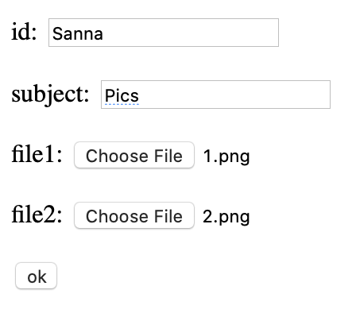
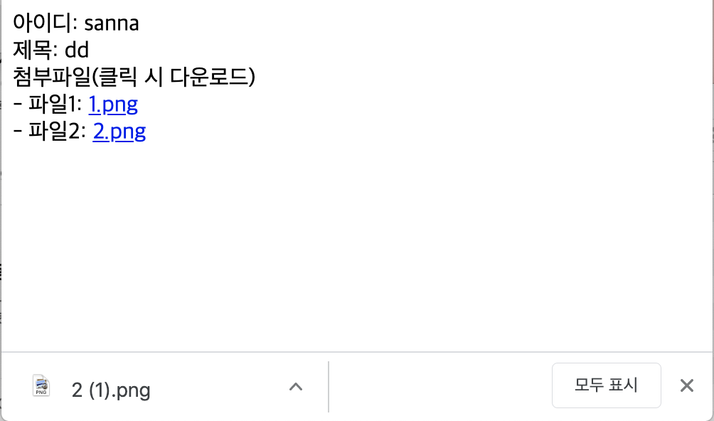

- Development in JSP 읽어보고 실습할 것

- Registration form :
https://github.com/SusannaJung/WebCamp2020/blob/master/JSP4/WebContent/registration.jsp

- login form :
https://github.com/SusannaJung/WebCamp2020/blob/master/JSP4/WebContent/login_index.jsp

- uploading file (cos.jar 파일 사용)
- downloading file
:https://github.com/SusannaJung/WebCamp2020/tree/master/JSP4/WebContent/uploadtest

- 완성본 화면캡처 구글 드라이브 공유 : 

https://docs.google.com/presentation/d/1Zf42TKThDUnKlwqpqvI4hhOZBI24hisBAI9gejTXgm0/edit#slide=id.g6d907407cd_7_5

upload:

download:

  

