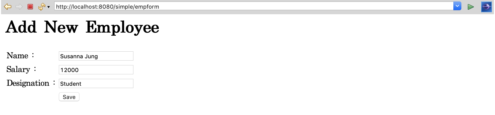
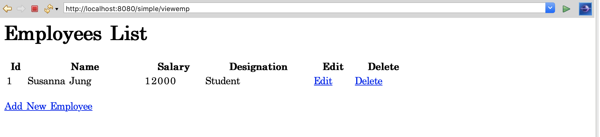

1) Spring MVC CRUD Example(MySQL JDBC) :

<a href="https://github.com/SusannaJung/WebCamp2020/tree/master/SpringMVCRUD">https://github.com/SusannaJung/WebCamp2020/tree/master/SpringMVCRUD</a>

  

 
